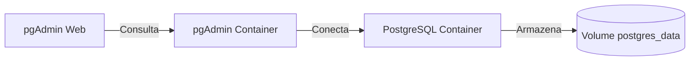

# Exercício 8 - Docker Compose com PostgreSQL e pgAdmin

## Objetivo
Configurar um ambiente completo com PostgreSQL e pgAdmin usando Docker Compose, permitindo a administração do banco de dados via interface web.

---

## Tecnologias Utilizadas
- Docker Compose
- PostgreSQL
- pgAdmin 4
- Docker Volumes

---

## Passo a Passo

### 1. Estrutura do Projeto
```
ex8/
├── docker-compose.yml
├── postgres/
│   └── init.sql          # Opcional: scripts SQL iniciais
└── README.md
```

### 2. Arquivo docker-compose.yml
```yaml
version: '3.8'

services:
  postgres:
    image: postgres:13
    container_name: postgres
    environment:
      POSTGRES_USER: admin
      POSTGRES_PASSWORD: secret
      POSTGRES_DB: mydb
    volumes:
      - postgres_data:/var/lib/postgresql/data
      - ./postgres/init.sql:/docker-entrypoint-initdb.d/init.sql
    ports:
      - "5432:5432"
    networks:
      - db-network

  pgadmin:
    image: dpage/pgadmin4
    container_name: pgadmin
    environment:
      PGADMIN_DEFAULT_EMAIL: admin@admin.com
      PGADMIN_DEFAULT_PASSWORD: admin123
    ports:
      - "5050:80"
    depends_on:
      - postgres
    networks:
      - db-network

networks:
  db-network:
    driver: bridge

volumes:
  postgres_data:
```

### 3. Iniciar os Serviços
```bash
docker-compose up -d
```

### 4. Acessar o pgAdmin
Acesse no navegador:
```
http://localhost:5050
```
Credenciais:
- Email: admin@admin.com
- Senha: admin123

### 5. Conectar ao PostgreSQL via pgAdmin
1. Clique em "Add New Server"
2. Na aba "General":
   - Name: Docker Postgres
3. Na aba "Connection":
   - Host: postgres
   - Port: 5432
   - Username: admin (definido no compose)
   - Password: secret (definido no compose)

---

## Comandos Úteis
```
| Comando                                          | Descrição                      |
|--------------------------------------------------|--------------------------------|
| `docker-compose ps`                              | Lista serviços em execução     |
| `docker-compose logs -f postgres`                | Mostra logs do PostgreSQL      |
| `docker exec -it postgres psql -U admin -d mydb` | Acessa o banco via CLI         |
| `docker-compose down -v`                         | Para serviços e remove volumes |
```

---

## Fluxo de Dados


---

## Dificuldades Comuns e Soluções

1. **Problema**: pgAdmin não consegue conectar ao PostgreSQL  
   **Solução**: Verifique se usou o nome do serviço (`postgres`) como hostname

2. **Problema**: Dados não persistem após reinício  
   **Solução**: Confira se o volume está corretamente mapeado no compose

3. **Problema**: Erro de permissão no PostgreSQL  
   **Solução**: Execute `chmod -R 755 postgres/` nos arquivos SQL locais

---

## Melhores Práticas Implementadas

✔️ Uso de variáveis de ambiente para credenciais  
✔️ Rede dedicada para comunicação entre containers  
✔️ Volume persistente para dados do PostgreSQL  
✔️ Inicialização automática via scripts SQL  
✔️ Separação clara de serviços no compose  

---

## Referências
- [Documentação Oficial PostgreSQL Docker](https://hub.docker.com/_/postgres)
- [Documentação pgAdmin Docker](https://www.pgadmin.org/docs/pgadmin4/latest/container_deployment.html)
- [Docker Compose Networking](https://docs.docker.com/compose/networking/)

---

## Autor
Thiago Resende  
[Repositório GitHub](https://github.com/ThiagoResende88/exerciciosDockerCompass/tree/main/ex8)

